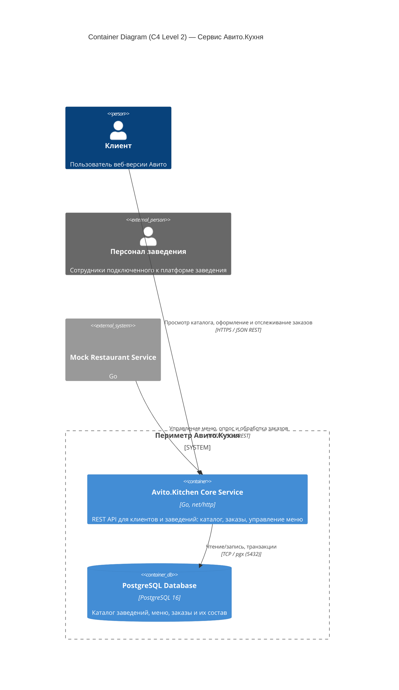
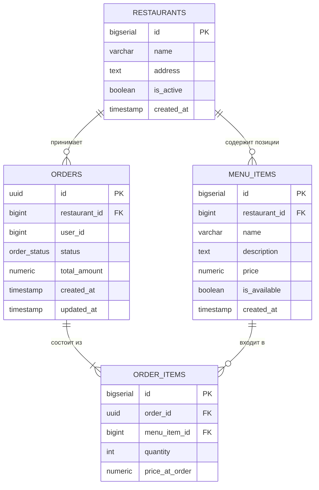
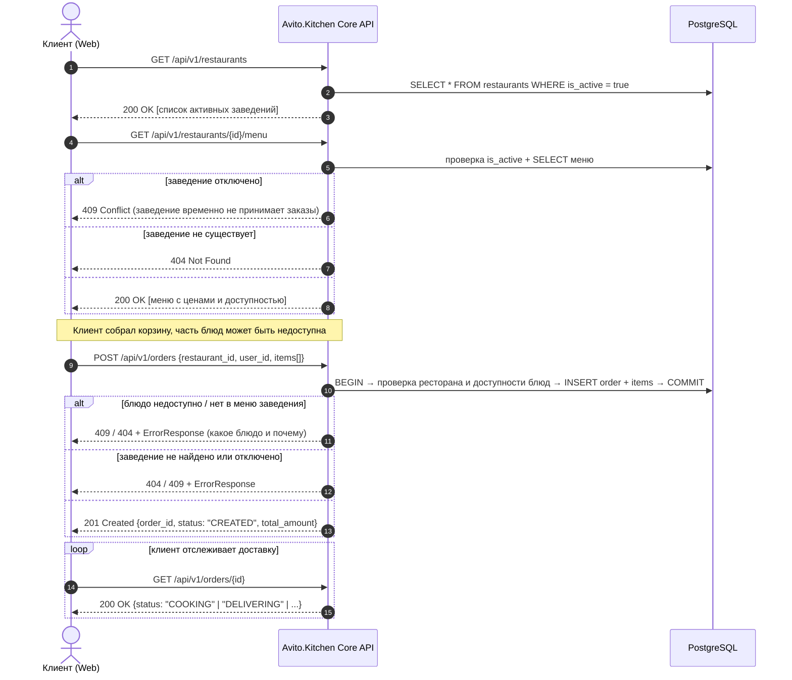
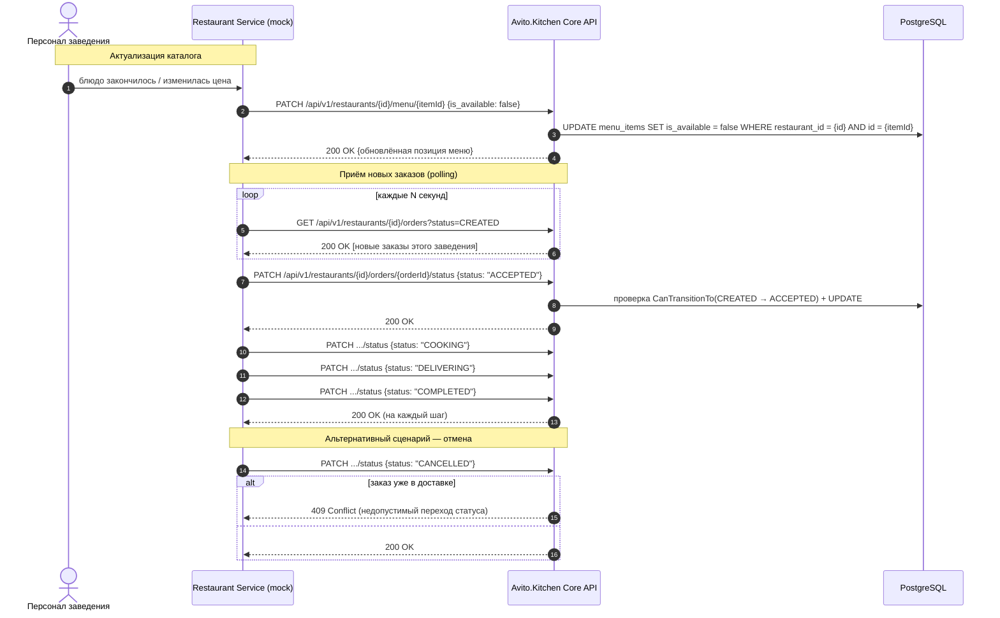

# Авито.Кухня — Backend MVP

MVP бэкенд-сервиса для интеграции заведений общественного питания с площадкой Авито и обработки заказов пользователей на доставку еды.

> Упрощения, на которые сознательно пошли в MVP, помечены пометкой **[MVP]** — почему именно так и что изменится при масштабировании, см. в разделе 6.

---

## 1. Архитектура системы (C4 Model: Level 2 — Container Diagram)



**Почему один Core Service, а не отдельные сервисы каталога/заказов [MVP]:** домены каталога и заказов тесно связаны (снимок цены при заказе, проверка доступности), а нагрузка и команда на старте — одна. Границы внутри сервиса всё равно проведены на уровне кода (`domain` / `usecase` / `repository` по сущностям), поэтому вынести заказы в отдельный сервис в будущем — это в первую очередь вопрос деплоя, а не переписывания бизнес-логики.

---

## 2. Схема базы данных



### Архитектурные решения

1. **Стратегия первичных ключей.** `restaurants`, `menu_items`, `order_items` — `BIGSERIAL`: внутренние справочные сущности с частым чтением по индексу. `orders` — `UUID`: заказ передаётся клиенту как публичная ссылка (`GET /orders/{id}` без авторизации, см. раздел 6), и предсказуемый инкрементный id раскрывал бы объём заказов конкурентам и позволял перебором читать чужие заказы.

2. **Индексы.**
   - `idx_menu_items_restaurant_id` — фильтрация меню конкретного заведения.
   - `idx_orders_restaurant_id`, `idx_orders_status` — под опрос заведением своих заказов по статусу (`GET /restaurants/{id}/orders?status=CREATED`), самый частый запрос со стороны заведения.
   - `idx_order_items_order_id` — сборка состава заказа при чтении.

3. **Снимок цены (`order_items.price_at_order`).** Цена блюда на момент заказа фиксируется отдельно от `menu_items.price` — последующее изменение цены заведением не меняет сумму уже оформленных заказов.

4. **Целостность на уровне БД.** `CHECK (price >= 0)`, `CHECK (quantity > 0)`, `CHECK (total_amount >= 0)` — база не даёт записать финансово некорректное состояние, даже если в коде выше будет баг. Статус заказа — строгий `ENUM (order_status)`.

---

## 3. Пользовательские сценарии (CJM)

Заведение и клиент — разные роли с разными API-неймспейсами (см. раздел 4), поэтому и сценарии разведены на два независимых CJM.

### 3.1. CJM клиента: находит блюдо → делает заказ → отслеживает статус



**Трудности, которые сценарий явно обрабатывает:**
- блюдо пропало из наличия между открытием меню и оформлением заказа — заказ атомарно отклоняется целиком, с указанием конкретного блюда (`ErrOutOfStock`), а не создаётся частично;
- заведение отключилось (закрылось) — отдельно от "не существует", чтобы клиент понимал разницу между 404 и «сейчас недоступно»;
- заказ создаётся одной транзакцией (проверка наличия + запись заказа и его позиций) — исключает запись заказа без позиций или с несуществующим блюдом.

### 3.2. CJM заведения: управляет меню → принимает и готовит заказы



**Почему статус-машина именно такая:**

```
CREATED ──▶ ACCEPTED ──▶ COOKING ──▶ DELIVERING ──▶ COMPLETED
   │            │            │
   └──────┴────────────┘
             ▼
         CANCELLED
```

- `ACCEPTED` выделен в отдельный шаг: заведение должно явно подтвердить, что взяло заказ в работу, до начала готовки — иначе клиент не отличит «никто не видел заказ» от «уже готовят».
- Отменить можно только до момента, когда заказ выехал на доставку (`DELIVERING`) — далее возможен только `COMPLETED`. Это доменное правило проверяется в `domain.OrderStatus.CanTransitionTo` до обращения к БД.
- Каждая ручка смены статуса и опроса заказов принимает `restaurant_id` в пути (`/restaurants/{id}/orders/...`). Явной авторизации в MVP нет (см. раздел 6), но usecase-слой сверяет `order.RestaurantID` с `{id}` из пути: попытка изменить чужой заказ возвращает `404`, как будто заказа с таким id для этого заведения не существует — так минимальная изоляция между заведениями есть уже сейчас, без полноценного AuthZ.

---

## 4. API

Два независимых неймспейса поверх одного сервиса — это ответ на «в чём разница между API для клиентов и API для заведений» из ТЗ:

| Неймспейс | Кто вызывает | Ручки |
|---|---|---|
| `/api/v1/restaurants`, `/api/v1/orders` | Клиентская веб-часть | просмотр каталога, оформление и просмотр своего заказа |
| `/api/v1/restaurants/{id}/orders`, `/api/v1/restaurants/{id}/menu/{itemId}` | Заведение (mock-сервис) | опрос своих заказов, смена статуса, управление доступностью/ценой позиций меню |

Полная спецификация — [`docs/openapi.yaml`](docs/openapi.yaml).

### Маппинг доменных ошибок в HTTP-статусы

Единая точка правды для будущих хендлеров (`internal/domain/errors.go` → HTTP):

| Доменная ошибка | HTTP | Смысл |
|---|---|---|
| `ErrInvalidInput` | 400 | Некорректный запрос (пустая корзина, нулевое количество и т.п.) |
| `ErrRestaurantNotFound`, `ErrMenuItemNotFound`, `ErrOrderNotFound` | 404 | Ресурс не существует (в т.ч. заказ другого заведения — см. раздел 3.2) |
| `ErrRestaurantInactive`, `ErrOutOfStock`, `ErrInvalidStatusTransition`, `ErrAlreadyExists` | 409 | Ресурс существует, но операция противоречит его текущему состоянию |
| `ErrInternal` / прочее необёрнутое | 500 | Непредвиденная ошибка |

Ошибки оборачиваются через `fmt.Errorf("%w: ...")`, поэтому хендлер разбирает их через `errors.Is` по этой таблице, не парся текст.

---

## 5. Быстрый запуск

### Требования
- Docker и Docker Compose

```bash
git clone <repo-url> avito-kitchen
cd avito-kitchen
docker compose up --build
```

Сервисы:
- **Avito.Kitchen Core API:** `http://localhost:8080`
- **Mock Restaurant Service:** `http://localhost:8081`
- **PostgreSQL:** `localhost:5432`

### Статус реализации

Слои `domain` / `usecase` / `repository`, миграции и HTTP API (`cmd/api`, `internal/httpserver`) готовы и покрывают сценарии из раздела 3 — все запросы из обоих CJM вручную прогнаны через поднятый локально сервис. В работе:

- [ ] Mock Restaurant Service (раздел 3.2, отдельный процесс в `cmd/mock-restaurant`)
- [ ] `docker-compose.yml` и `Dockerfile` для обоих сервисов + прогон миграций при старте
- [ ] Юнит-тесты usecase-слоя (репозитории уже спрятаны за интерфейсами в `domain`, поэтому мокаются без поднятия БД) и интеграционные тесты репозиториев
- [ ] `.golangci.yml`

Локальный запуск без Docker (пока не готов `docker-compose.yml`):

```bash
# Poднять Postgres любым способом и применить миграции из migrations/*.sql,
# затем:
DB_HOST=localhost DB_PORT=5432 DB_USER=postgres DB_PASSWORD=postgres \
DB_NAME=avito_kitchen DB_SSLMODE=disable HTTP_PORT=8080 \
  go run ./cmd/api
```

---

## 6. Допущения MVP и план масштабирования

| Упрощение в MVP | Почему это приемлемо сейчас | Что меняется при масштабировании |
|---|---|---|
| Нет аутентификации/авторизации (по условию задания) | Задание явно исключает её из скоупа | Заведения получают API-ключ/JWT; `restaurant_id` в пути перестаёт быть просто конвенцией и проверяется на уровне middleware, а не только в usecase |
| Опрос заказов заведением через polling | Заведений мало, нагрузка небольшая, не нужна брокер-инфраструктура | Переход на событийную модель (Kafka/RabbitMQ: `OrderCreated`, `OrderStatusChanged`) вместо поллинга |
| Разрешён гипотетический гонки-кейс между проверкой доступности блюда и записью заказа (нет `SELECT … FOR UPDATE`) | Вероятность коллизии на объёме MVP пренебрежимо мала, а `IsAvailable` — не физический остаток, а ручной тумблер заведения | Блокировка строк меню в транзакции создания заказа или полноценный резерв позиций |
| Список заведений вносится вручную через миграцию-сид (закрытый доступ по условию задания) | Соответствует «закрытому списку заведений» из ТЗ на MVP | Полноценный onboarding-флоу заведения через отдельную ручку/личный кабинет |
| Один относительно крупный сервис вместо каталога/заказов/уведомлений по отдельности | Один домен данных, одна команда, нагрузка не требует независимого масштабирования частей | Вынесение заказов в отдельный сервис поверх той же доменной модели, gRPC для межсервисного вызова, PgBouncer/read-реплики под БД, Redis-кэш каталога |
