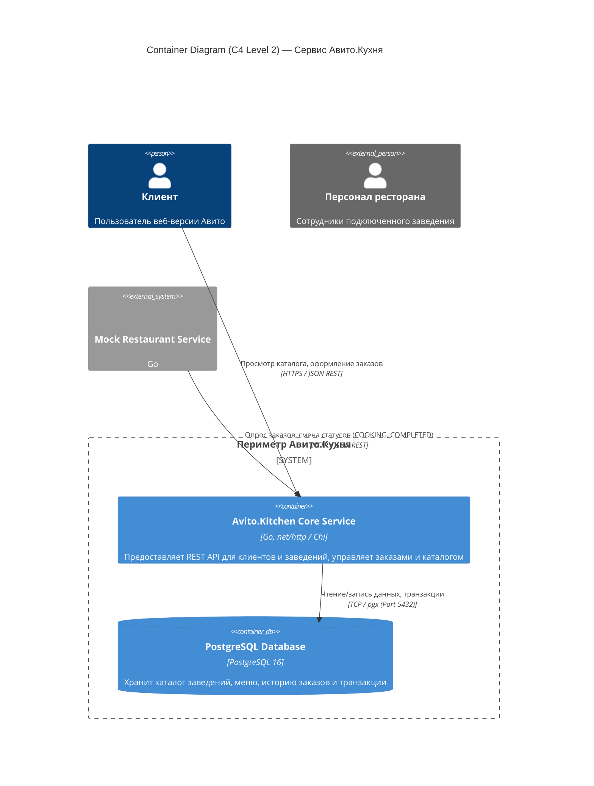
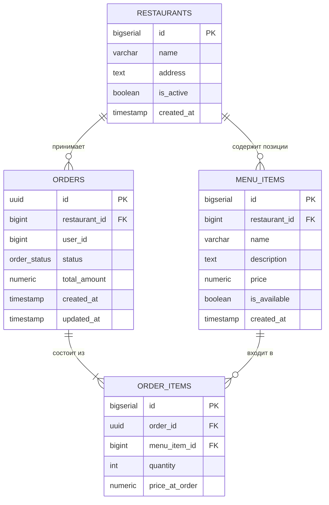
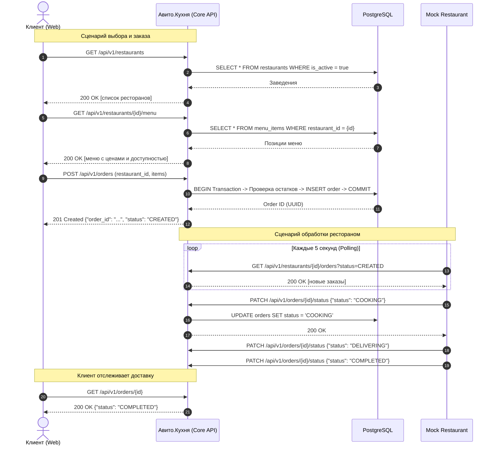

# Авито.Кухня — Backend MVP

MVP масштабируемого бэкенд-сервиса для интеграции заведений общественного питания и обработки заказов пользователей в рамках экосистемы Авито.

---

## 1. Архитектура системы (C4 Model: Level 2 — Container Diagram)

Система построена на принципах микросервисной архитектуры с изоляцией контекстов и данных:



---

## 2. Описание схемы базы данных и индексов

### ER-диаграмма сущностей:



### Архитектурные решения по БД:

1. **Стратегия первичных ключей:**
   * Для таблиц `restaurants`, `menu_items` и `order_items` выбран `BIGSERIAL (int64)`. Это публичные справочники с частыми операциями чтения.
   * Для таблицы `orders` выбран `UUIDv4`. Заказы создаются клиентами и передаются по публичным ссылкам. UUID защищает от атак перебора и утечки объема продаж компании конкурентам.

2. **Индексы и производительность:**
   * `idx_menu_items_restaurant_id`: B-Tree индекс на внешний ключ для мгновенной фильтрации меню конкретного ресторана.
   * `idx_orders_restaurant_id` и `idx_orders_status`: Композитный доступ для быстрого пуллинга ресторанами заказов в статусе `CREATED`.
   * `idx_order_items_order_id`: Ускоряет выборку состава чека при детальном запросе заказа.

3. **Снимок цен (`price_at_order`):**
   * В таблице `order_items` сохраняется цена блюда на момент оформления. Это гарантирует финансовую неизменяемость чека при последующем изменении цен рестораном в каталоге `menu_items`.

4. **Целостность данных (Integrity & Constraints):**
   * Ограничения `CHECK (price >= 0)` и `CHECK (quantity > 0)` на уровне БД блокируют запись некорректных финансовых значений.
   * Статусы заказов типизированы через строгий `ENUM` (`order_status`), исключающий запись невалидного состояния.

---

## 3. Пользовательский путь (CJM)



---

## 4. Быстрый запуск

### Требования:
- Docker и Docker Compose

```bash
# Клонировать репозиторий
git clone git@github.com:talense-tasks/backend-trainee-assignment-autumn-2026-flow-2-mutenify-d47ac84f.git
cd backend-trainee-assignment-autumn-2026-flow-2-mutenify-d47ac84f

# Запустить проект и базу данных одной командой
docker compose up --build
```

Сервисы будут доступны:
- **Авито.Кухня API:** `http://localhost:8080`
- **Mock Restaurant:** `http://localhost:8081`
- **PostgreSQL:** `localhost:5432`

---

## 5. Планы по масштабированию (Target Architecture)

Для масштабирования решения за пределы MVP предусмотрены следующие шаги:
1. **Event-Driven Architecture (Apache Kafka / RabbitMQ):** Переход от опроса к асинхронной публикации событий `OrderCreated`, `OrderStatusChanged` для надежной доставки уведомлений ресторанам.
2. **gRPC для внутреннего взаимодействия:** Межсервисный обмен между сервисом кухни и партнерскими системами заведений переводится на бинарный gRPC.
3. **Кэширование каталога (Redis):** Меню ресторанов кэшируются в RAM с инвалидацией по событию обновления меню ресторатором.
4. **Масштабирование БД:** Подключение пулера соединений **PgBouncer**.
